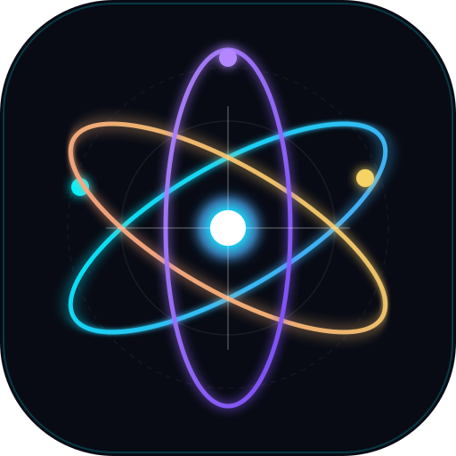

# Asadin Edu Physics (PhysTaxa) 🌌⚛️

> **Interactive Physics Encyclopedia + Learning Platform**
> Ensiklopedia Fisika Interaktif & Platform Pembelajaran Mandiri dari Tingkat SD sampai Kuliah.



---

## 🌟 Tentang Platform

**Asadin Edu Physics** adalah platform eksplorasi sains terbuka yang memetakan **Realitas Fisik (Physical Reality)** alam semesta:
* Bukan sekadar kalkulator fisika
* Bukan kumpulan rumus hafalan
* Bukan bank soal atau Wikipedia clone

Aplikasi ini memungkinkan pengguna menjelajahi bagaimana alam semesta bekerja secara interaktif, dari gerak benda sehari-hari hingga partikel fundamental, mekanika kuantum, dan kosmologi.

---

## 🔬 Fitur Utama

1. **28 Domain Fisika Lengkap:**
   * *Foundations of Physics* (Pengukuran, Satuan SI, Vektor, Ketidakpastian)
   * *Mechanics* (Kinematika, Dinamika Newton, Usaha & Energi, Momentum, Rotasi, Gravitasi Kepler)
   * *Fluids, Oscillations & Waves* (Tekanan Hidrostatis, Archimedes, Asas Bernoulli, GHS Bandul, Akustik Doppler)
   * *Thermal & Thermodynamics* (Fisika Termal, Diagram P-V, Entropi, Siklus Mesin Carnot)
   * *Electricity & Magnetism* (Hukum Coulomb, Hukum Ohm, Gaya Lorentz, Induksi Faraday)
   * *Electromagnetism & Optics* (Persamaan Maxwell, Spektrum EM, Pembiasan Snellius, Kisi Difraksi)
   * *Modern Physics* (Relativitas Khusus $E=mc^2$, Relativitas Umum & Ruang-Waktu, Mekanika Kuantum Schrödinger)
   * *Atomic & Nuclear Physics* (Model Bohr, Deret Spektrum Balmer, Fisi & Fusi Nuklir)
   * *Particle Physics & The Standard Model* (Quark, Lepton, Boson Tolok, Mekanisme Higgs)
   * *Condensed Matter, Plasma, Astrophysics & Cosmology* (Superkonduktivitas Meissner, Tokamak, Evolusi Bintang, Big Bang, Materi Gelap)
   * *Applied Physics* (Fisika Medis MRI/CT, Serat Optik, Seismologi)

2. **12 Laboratorium Virtual Interaktif (60 FPS Engine):**
   * 🚀 Gerak Parabola & Balistik (dengan hambatan udara & preset gravitasi Bumi/Bulan/Mars/Jupiter)
   * ⏱️ Bandul Matematis & GHS Teredam (dengan grafik live kekekalan energi $E_k, E_p, E_{tot}$)
   * 🔊 Gelombang & Efek Doppler (subsonik hingga supersonik menampilkan kerucut Mach)
   * 〰️ Interferensi Celah Ganda Young (dengan spektrum laser dan profil intensitas)
   * ⚡ Kotak Pasir Muatan Elektrostatik Coulomb (tambah/geser muatan $+q$ dan $-q$ interaktif)
   * 🧲 Gaya Lorentz & Gerak Siklotron Partikel (lintasan melengkung dalam medan magnet $\vec{B}$)
   * 🔍 Optika: Pembiasan Snellius, Pemantulan Total (TIR) & Pelacak Sinar Lensa Tipis
   * ⚙️ Diagram P-V Siklus Carnot & Mesin Termal (usaha $W = \oint P dV$ dan efisiensi $\eta$)
   * ⏳ Dilatasi Waktu Relativitas Khusus (perbandingan jam atom diam vs wahana berkecepatan tinggi)
   * 🪐 Mekanika Orbit Kepler & Gravitasi Newton (lintasan lingkaran, elips, dan kecepatan lepas)
   * ⚛️ Model Kuantum Atom Bohr (transisi orbit elektron & emisi foton deret spektrum hidrogen)
   * 🌊 Dinamika Fluida Tabung Venturi & Asas Bernoulli (aliran garis arus & kolom manometer)

3. **Mesin Kedalaman Multi-Layer (4 Tingkat):**
   * **Sederhana (Intuisi):** Analogi konkret kehidupan sehari-hari (SD/SMP).
   * **Standar (Sekolah Menengah):** Definisi formal, notasi vektor, dan persamaan inti kurikulum SMA.
   * **Lanjut (Universitas):** Perumusan analitik kalkulus diferensial dan formulasi analitik.
   * **Deep Dive (Frontier):** Pertimbangan relativistik, teori medan kuantum, dan batas riset modern.

4. **Penjelajah Persamaan (Equation Explorer):**
   * Rincian variabel fisis interaktif (klik variabel untuk memeriksa simbol, satuan SI, dimensi, dan peran fisikanya).
   * Simulator & Kalkulator Numerik Langsung yang menghitung parameter seketika.
   * Asumsi keberlakuan, batasan fisis, dan contoh soal penyelesaian.

5. **Penjelajah Konstanta Fisika Fundamental:**
   * Berbasis data resmi **CODATA 2018/2022** dan definisi ulang SI 2019 ($c, h, \hbar, G, e, k_B, N_A, m_e, m_p, \varepsilon_0, \mu_0, \sigma, R_\infty, R, \alpha, g_0, H_0$).

6. **Ensiklopedia Eksperimen Bersejarah:**
   * Celah Ganda Young, Neraca Torsi Cavendish, Efek Fotolistrik Einstein, Hamburan Emas Rutherford, Interferometer Michelson-Morley, Tetes Minyak Millikan.

7. **Physics Knowledge Graph:**
   * Peta jejaring interaktif berbasis fisika gaya (*force-directed physics*), mendukung seret node, zoom, dan penelusuran relasi tanpa *dead-end*.

8. **Kurikulum 5 Jenjang:**
   * Modul terstruktur untuk jenjang **SD**, **SMP**, **SMA**, **Universitas**, dan **Educator (Guru)** dilengkapi bank kuis evaluasi interaktif.

---

## 🚀 Menjalankan Secara Mandiri

Aplikasi ini murni berjalan di atas standar web modern (Vanilla ES Modules & CSS) tanpa dependensi runtime pihak ketiga yang rapuh.

### Menjalankan Server Lokal:
```bash
# Menjalankan server dev
PORT=8088 node server/server.mjs
```
Lalu buka browser di `http://127.0.0.1:8088/`.

### Menjalankan Audit & Tes Ilmiah:
```bash
npm test
```

---

## 📜 Lisensi & Standar
* Hak Cipta © 2026 Asadin Edu. Terbuka untuk kemajuan pendidikan sains.
* Standar Satuan: **BIPM SI Brochure (9th Edition)** & **CODATA Recommended Values**.
